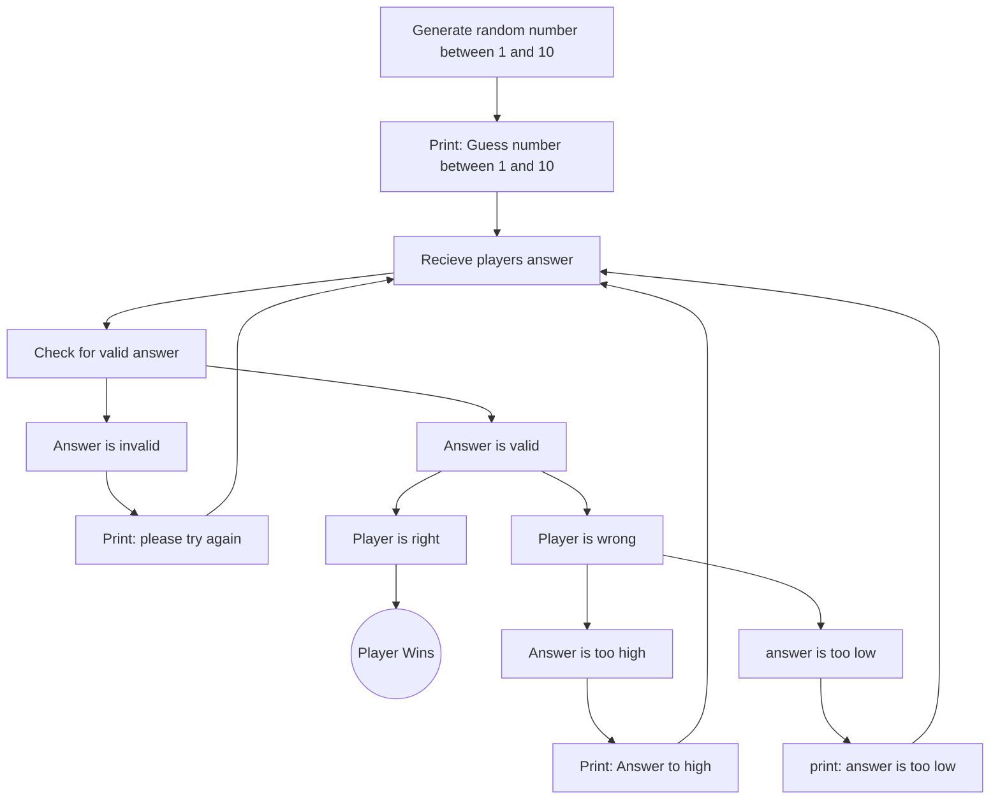

```mermaid
flowchart TD
generate[Generate random number between 1 and 10] --> print_Q[Print: Guess number between 1 and 10]
print_Q --> get_answer[Recieve players answer]
    get_answer --> checkv[Check for valid answer]
    checkv --> valid[Answer is valid]
    checkv --> nvalid[Answer is invalid]
    nvalid --> try_again[Print: please try again]
    try_again --> get_answer
    valid --> player_right[Player is right]
    player_right --> win((Player Wins))
    valid --> player_wrong[Player is wrong]
    player_wrong --> too_high[Answer is too high]
    too_high --> print_too_high[Print: Answer to high]
    print_too_high --> get_answer
    player_wrong --> too_low[answer is too low]
    too_low --> print_too_low[print: answer is too low]
    print_too_low --> get_answer
```