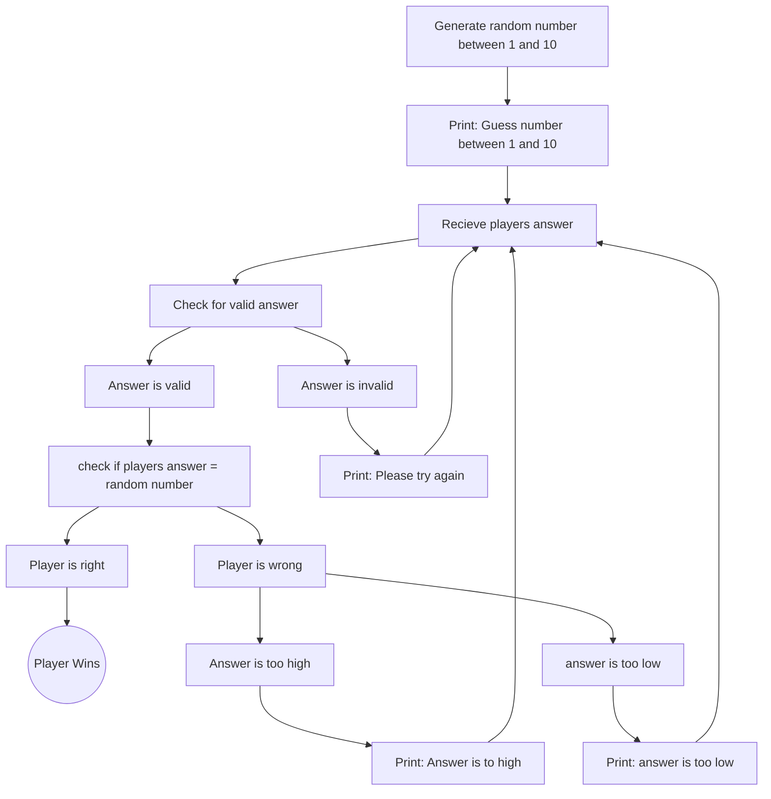

    The game starts out by generating a random number between 1 and 100.  
    The program then asks the player to choose a number between 1 and 10.  
    The program then recieves the players answer  
    he answer is then checked to to see if it is valid (between 1 and 10 and numerical characters)  
    If the answer is invalid, the program prints "Please try again" and the player is asked again  
    This repeats until the answer is valid  
    If the answer in valid, it is checked to see if it equals the random number  
    If the players answer is wrong, it is then checked to see if its too high or too low  
    If its to high, the program prints "Answer is too high" then loops back to the player inputing a new answer  
    If its to low, the program prints "Answer is too low" then loops back to the player inputing  a new answer  
    f the Player's answer equals the random number, the player wins   

